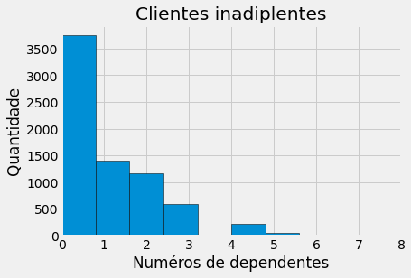
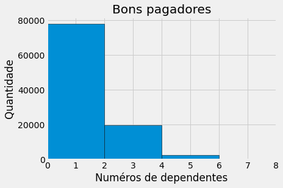
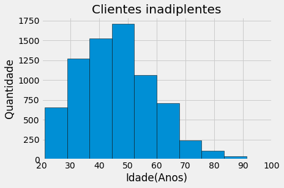
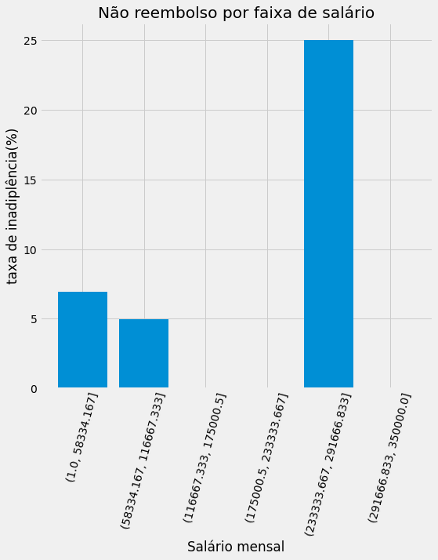
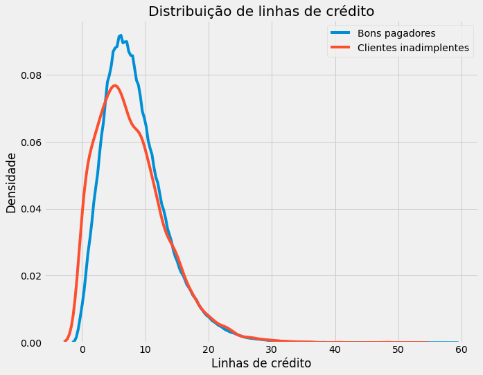
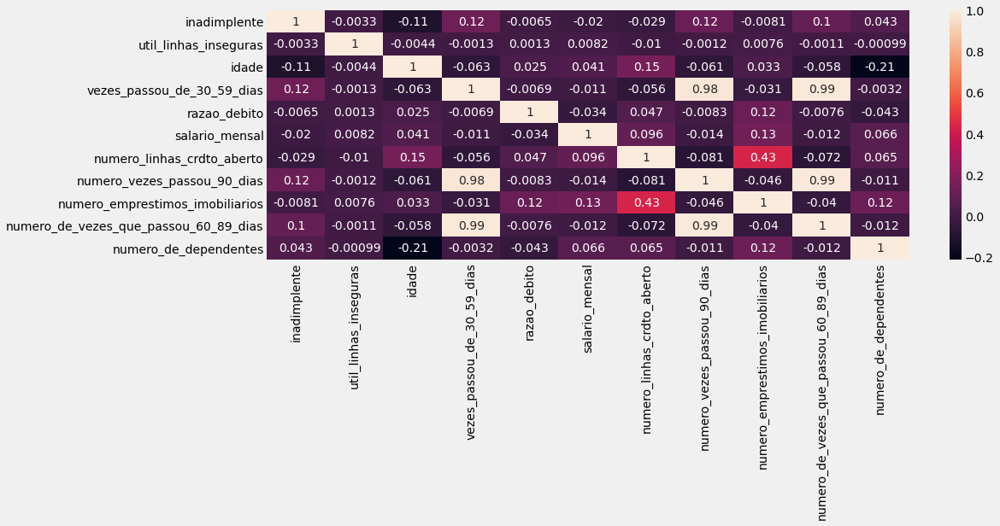
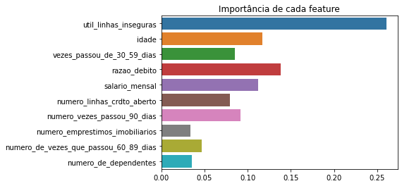
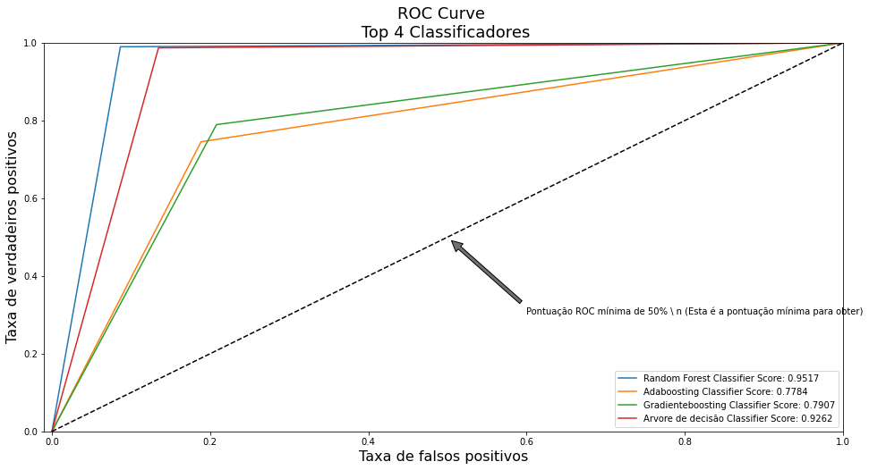

#### Descrição do problema

Os modelos de pontuação de crédito calculam a probabilidade de incumprimento e são uma das principais ferramentas utilizadas por várias empresas para aprovar ou negar crédito.
O **principal objetivo** desse projeto, após o modelo treinado, será **concessão** crédito ou não para clientes solicitantes, com a possibilidade de acompanhar o desempenho das previsões através de métricas.


**A construção do modelo preditivo seguirá um processo geral com as fases abaixo:**

1º - **Coletar os dados**

2º - **Explorar os dados**: as fases podem, em alguns momentos, ser intercaladas entre si:

Explorar as características dos dados;
   
Explorar os dados estatisticamente;
  
Identificar valores ausentes;
   
Identificar ruídos nos dados(outliers);
   
Explorar os dados visualmente;
   
Estudar as distribuições dos atributos;
   
Estudar possíveis correlações entre os atributos.

3º - **Preparar os dados:**

Fixar ou remover ruídos;
    
Engenharia de atributos;
    
Seleção de características(atributos);
   
Preencher valores ausentes(com média, zero...) ou removê-los.

4º - **Escolha e Afinamento de um Modelo:**

Treinar uma variedade de classificadores: como nosso problema é de natureza supervisionada, os algoritmos usados deverão atender essa característica;

Medir e comparar as performances;
    
Selecionar o melhor modelo;
   
Afinar e Tunar o modelo;

5º - **Avaliar e Validar:**

Feita em paralelo com a fase anterior.


## Importando bibliotecas


```python

import numpy as np
import pandas as pd
from dfply import *

import seaborn as sns
import matplotlib.pyplot as plt
from plotly.offline import init_notebook_mode, iplot
import plotly.graph_objs as go
from plotly import tools
init_notebook_mode(connected=True)
#necessário para plotar com plotly diretamente do dataframe

import cufflinks as cf
cf.go_offline()
#classifier
from sklearn.ensemble import RandomForestClassifier
#Classes utilitárias
from helper import *
import warnings
from sklearn.pipeline import Pipeline
warnings.filterwarnings("ignore")
```


<script type="text/javascript">
window.PlotlyConfig = {MathJaxConfig: 'local'};
if (window.MathJax) {MathJax.Hub.Config({SVG: {font: "STIX-Web"}});}
if (typeof require !== 'undefined') {
require.undef("plotly");
requirejs.config({
    paths: {
        'plotly': ['https://cdn.plot.ly/plotly-latest.min']
    }
});
require(['plotly'], function(Plotly) {
    window._Plotly = Plotly;
});
}
</script>


<script type="text/javascript">
window.PlotlyConfig = {MathJaxConfig: 'local'};
if (window.MathJax) {MathJax.Hub.Config({SVG: {font: "STIX-Web"}});}
if (typeof require !== 'undefined') {
require.undef("plotly");
requirejs.config({
    paths: {
        'plotly': ['https://cdn.plot.ly/plotly-latest.min']
    }
});
require(['plotly'], function(Plotly) {
    window._Plotly = Plotly;
});
}
</script>


```python
data_train = pd.read_csv("treino.csv")
train_labels = data_train['inadimplente']
features_train = data_train.drop(columns = ['inadimplente'])
```


```python
data_train >> head(5)
```


<div>
<style scoped>
    .dataframe tbody tr th:only-of-type {
        vertical-align: middle;
    }

    .dataframe tbody tr th {
        vertical-align: top;
    }

    .dataframe thead th {
        text-align: right;
    }
</style>
<table border="1" class="dataframe">
  <thead>
    <tr style="text-align: right;">
      <th></th>
      <th>inadimplente</th>
      <th>util_linhas_inseguras</th>
      <th>idade</th>
      <th>vezes_passou_de_30_59_dias</th>
      <th>razao_debito</th>
      <th>salario_mensal</th>
      <th>numero_linhas_crdto_aberto</th>
      <th>numero_vezes_passou_90_dias</th>
      <th>numero_emprestimos_imobiliarios</th>
      <th>numero_de_vezes_que_passou_60_89_dias</th>
      <th>numero_de_dependentes</th>
    </tr>
  </thead>
  <tbody>
    <tr>
      <th>0</th>
      <td>1</td>
      <td>0.766127</td>
      <td>45</td>
      <td>2</td>
      <td>0.802982</td>
      <td>9120.0</td>
      <td>13</td>
      <td>0</td>
      <td>6</td>
      <td>0</td>
      <td>2.0</td>
    </tr>
    <tr>
      <th>1</th>
      <td>0</td>
      <td>0.957151</td>
      <td>40</td>
      <td>0</td>
      <td>0.121876</td>
      <td>2600.0</td>
      <td>4</td>
      <td>0</td>
      <td>0</td>
      <td>0</td>
      <td>1.0</td>
    </tr>
    <tr>
      <th>2</th>
      <td>0</td>
      <td>0.658180</td>
      <td>38</td>
      <td>1</td>
      <td>0.085113</td>
      <td>3042.0</td>
      <td>2</td>
      <td>1</td>
      <td>0</td>
      <td>0</td>
      <td>0.0</td>
    </tr>
    <tr>
      <th>3</th>
      <td>0</td>
      <td>0.233810</td>
      <td>30</td>
      <td>0</td>
      <td>0.036050</td>
      <td>3300.0</td>
      <td>5</td>
      <td>0</td>
      <td>0</td>
      <td>0</td>
      <td>0.0</td>
    </tr>
    <tr>
      <th>4</th>
      <td>0</td>
      <td>0.907239</td>
      <td>49</td>
      <td>1</td>
      <td>0.024926</td>
      <td>63588.0</td>
      <td>7</td>
      <td>0</td>
      <td>1</td>
      <td>0</td>
      <td>0.0</td>
    </tr>
  </tbody>
</table>
</div>


## 2. Explorar os dados 

### Tamanho do conjunto de dados


```python
print('Existem {} muntuários no conjunto de dados'.format(len(data_train)))
```

    Existem 110000 muntuários no conjunto de dados
    

### Tipos de dados


```python
data_train.dtypes
```


    inadimplente                               int64
    util_linhas_inseguras                    float64
    idade                                      int64
    vezes_passou_de_30_59_dias                 int64
    razao_debito                             float64
    salario_mensal                           float64
    numero_linhas_crdto_aberto                 int64
    numero_vezes_passou_90_dias                int64
    numero_emprestimos_imobiliarios            int64
    numero_de_vezes_que_passou_60_89_dias      int64
    numero_de_dependentes                    float64
    dtype: object


```python
data_train.info()
```

    <class 'pandas.core.frame.DataFrame'>
    RangeIndex: 110000 entries, 0 to 109999
    Data columns (total 11 columns):
     #   Column                                 Non-Null Count   Dtype  
    ---  ------                                 --------------   -----  
     0   inadimplente                           110000 non-null  int64  
     1   util_linhas_inseguras                  110000 non-null  float64
     2   idade                                  110000 non-null  int64  
     3   vezes_passou_de_30_59_dias             110000 non-null  int64  
     4   razao_debito                           110000 non-null  float64
     5   salario_mensal                         88237 non-null   float64
     6   numero_linhas_crdto_aberto             110000 non-null  int64  
     7   numero_vezes_passou_90_dias            110000 non-null  int64  
     8   numero_emprestimos_imobiliarios        110000 non-null  int64  
     9   numero_de_vezes_que_passou_60_89_dias  110000 non-null  int64  
     10  numero_de_dependentes                  107122 non-null  float64
    dtypes: float64(4), int64(7)
    memory usage: 9.2 MB
    

### Descrição dos dados


```python
df_float_values_train = data_train.select_dtypes('float64')
```


```python
df_float_values_train.describe()
```


<div>
<style scoped>
    .dataframe tbody tr th:only-of-type {
        vertical-align: middle;
    }

    .dataframe tbody tr th {
        vertical-align: top;
    }

    .dataframe thead th {
        text-align: right;
    }
</style>
<table border="1" class="dataframe">
  <thead>
    <tr style="text-align: right;">
      <th></th>
      <th>util_linhas_inseguras</th>
      <th>razao_debito</th>
      <th>salario_mensal</th>
      <th>numero_de_dependentes</th>
    </tr>
  </thead>
  <tbody>
    <tr>
      <th>count</th>
      <td>110000.000000</td>
      <td>110000.000000</td>
      <td>8.823700e+04</td>
      <td>107122.000000</td>
    </tr>
    <tr>
      <th>mean</th>
      <td>5.929979</td>
      <td>354.823589</td>
      <td>6.637411e+03</td>
      <td>0.757482</td>
    </tr>
    <tr>
      <th>std</th>
      <td>252.301965</td>
      <td>2074.140421</td>
      <td>1.338395e+04</td>
      <td>1.114670</td>
    </tr>
    <tr>
      <th>min</th>
      <td>0.000000</td>
      <td>0.000000</td>
      <td>0.000000e+00</td>
      <td>0.000000</td>
    </tr>
    <tr>
      <th>25%</th>
      <td>0.030054</td>
      <td>0.175016</td>
      <td>3.400000e+03</td>
      <td>0.000000</td>
    </tr>
    <tr>
      <th>50%</th>
      <td>0.155936</td>
      <td>0.366682</td>
      <td>5.400000e+03</td>
      <td>0.000000</td>
    </tr>
    <tr>
      <th>75%</th>
      <td>0.562806</td>
      <td>0.866874</td>
      <td>8.225000e+03</td>
      <td>1.000000</td>
    </tr>
    <tr>
      <th>max</th>
      <td>50708.000000</td>
      <td>329664.000000</td>
      <td>3.008750e+06</td>
      <td>20.000000</td>
    </tr>
  </tbody>
</table>
</div>


Pode ser notado uma ausência de valores nas variáveis salário mensal e número de dependetes e que em todas as variáveis floats existem valores zero, podendo ser observado na categoria **min**, o que é algo normal para descrição dessas colunas. O valor máximo da variável dependente é 20, sendo uma boa probabilidade de outliers.

### Dados ausentes


```python
total = data_train.isnull().sum().sort_values(ascending = False)
percent = (data_train.isnull().sum()/data_train.isnull().count()*100).sort_values(ascending = False)
missing_train_data  = pd.concat([total, percent], axis=1, keys=['Total', 'Percent'])
missing_train_data.head(10)
```


<div>
<style scoped>
    .dataframe tbody tr th:only-of-type {
        vertical-align: middle;
    }

    .dataframe tbody tr th {
        vertical-align: top;
    }

    .dataframe thead th {
        text-align: right;
    }
</style>
<table border="1" class="dataframe">
  <thead>
    <tr style="text-align: right;">
      <th></th>
      <th>Total</th>
      <th>Percent</th>
    </tr>
  </thead>
  <tbody>
    <tr>
      <th>salario_mensal</th>
      <td>21763</td>
      <td>19.784545</td>
    </tr>
    <tr>
      <th>numero_de_dependentes</th>
      <td>2878</td>
      <td>2.616364</td>
    </tr>
    <tr>
      <th>numero_de_vezes_que_passou_60_89_dias</th>
      <td>0</td>
      <td>0.000000</td>
    </tr>
    <tr>
      <th>numero_emprestimos_imobiliarios</th>
      <td>0</td>
      <td>0.000000</td>
    </tr>
    <tr>
      <th>numero_vezes_passou_90_dias</th>
      <td>0</td>
      <td>0.000000</td>
    </tr>
    <tr>
      <th>numero_linhas_crdto_aberto</th>
      <td>0</td>
      <td>0.000000</td>
    </tr>
    <tr>
      <th>razao_debito</th>
      <td>0</td>
      <td>0.000000</td>
    </tr>
    <tr>
      <th>vezes_passou_de_30_59_dias</th>
      <td>0</td>
      <td>0.000000</td>
    </tr>
    <tr>
      <th>idade</th>
      <td>0</td>
      <td>0.000000</td>
    </tr>
    <tr>
      <th>util_linhas_inseguras</th>
      <td>0</td>
      <td>0.000000</td>
    </tr>
  </tbody>
</table>
</div>


Salário mensal possui 19,7% de valores faltantes, indicando que 21763 pessoas não possuem salários. Já de 110000 clintes, apenas 2,6% não pussem dependentes.

### Explorar os dados visualmente


```python
temp = data_train["inadimplente"].value_counts()
fig = {
  "data": [
    {
      "values": temp.values,
      "labels": temp.index,
      "domain": {"x": [0, .48]},
      "hole": .5,
      "type": "pie"
    },
    ],
  "layout": {
        "title":"SITUAÇÃO DE INADIPLÊNCIA"
    }
}
iplot(fig, filename='donut')
```


<div>                            <div id="3971de76-e1dd-4547-8c08-170f6d218881" class="plotly-graph-div" style="height:525px; width:100%;"></div>            <script type="text/javascript">                require(["plotly"], function(Plotly) {                    window.PLOTLYENV=window.PLOTLYENV || {};                                    if (document.getElementById("3971de76-e1dd-4547-8c08-170f6d218881")) {                    Plotly.newPlot(                        "3971de76-e1dd-4547-8c08-170f6d218881",                        [{"domain": {"x": [0, 0.48]}, "hole": 0.5, "labels": [0, 1], "type": "pie", "values": [102669, 7331]}],                        {"template": {"data": {"bar": [{"error_x": {"color": "#2a3f5f"}, "error_y": {"color": "#2a3f5f"}, "marker": {"line": {"color": "#E5ECF6", "width": 0.5}}, "type": "bar"}], "barpolar": [{"marker": {"line": {"color": "#E5ECF6", "width": 0.5}}, "type": "barpolar"}], "carpet": [{"aaxis": {"endlinecolor": "#2a3f5f", "gridcolor": "white", "linecolor": "white", "minorgridcolor": "white", "startlinecolor": "#2a3f5f"}, "baxis": {"endlinecolor": "#2a3f5f", "gridcolor": "white", "linecolor": "white", "minorgridcolor": "white", "startlinecolor": "#2a3f5f"}, "type": "carpet"}], "choropleth": [{"colorbar": {"outlinewidth": 0, "ticks": ""}, "type": "choropleth"}], "contour": [{"colorbar": {"outlinewidth": 0, "ticks": ""}, "colorscale": [[0.0, "#0d0887"], [0.1111111111111111, "#46039f"], [0.2222222222222222, "#7201a8"], [0.3333333333333333, "#9c179e"], [0.4444444444444444, "#bd3786"], [0.5555555555555556, "#d8576b"], [0.6666666666666666, "#ed7953"], [0.7777777777777778, "#fb9f3a"], [0.8888888888888888, "#fdca26"], [1.0, "#f0f921"]], "type": "contour"}], "contourcarpet": [{"colorbar": {"outlinewidth": 0, "ticks": ""}, "type": "contourcarpet"}], "heatmap": [{"colorbar": {"outlinewidth": 0, "ticks": ""}, "colorscale": [[0.0, "#0d0887"], [0.1111111111111111, "#46039f"], [0.2222222222222222, "#7201a8"], [0.3333333333333333, "#9c179e"], [0.4444444444444444, "#bd3786"], [0.5555555555555556, "#d8576b"], [0.6666666666666666, "#ed7953"], [0.7777777777777778, "#fb9f3a"], [0.8888888888888888, "#fdca26"], [1.0, "#f0f921"]], "type": "heatmap"}], "heatmapgl": [{"colorbar": {"outlinewidth": 0, "ticks": ""}, "colorscale": [[0.0, "#0d0887"], [0.1111111111111111, "#46039f"], [0.2222222222222222, "#7201a8"], [0.3333333333333333, "#9c179e"], [0.4444444444444444, "#bd3786"], [0.5555555555555556, "#d8576b"], [0.6666666666666666, "#ed7953"], [0.7777777777777778, "#fb9f3a"], [0.8888888888888888, "#fdca26"], [1.0, "#f0f921"]], "type": "heatmapgl"}], "histogram": [{"marker": {"colorbar": {"outlinewidth": 0, "ticks": ""}}, "type": "histogram"}], "histogram2d": [{"colorbar": {"outlinewidth": 0, "ticks": ""}, "colorscale": [[0.0, "#0d0887"], [0.1111111111111111, "#46039f"], [0.2222222222222222, "#7201a8"], [0.3333333333333333, "#9c179e"], [0.4444444444444444, "#bd3786"], [0.5555555555555556, "#d8576b"], [0.6666666666666666, "#ed7953"], [0.7777777777777778, "#fb9f3a"], [0.8888888888888888, "#fdca26"], [1.0, "#f0f921"]], "type": "histogram2d"}], "histogram2dcontour": [{"colorbar": {"outlinewidth": 0, "ticks": ""}, "colorscale": [[0.0, "#0d0887"], [0.1111111111111111, "#46039f"], [0.2222222222222222, "#7201a8"], [0.3333333333333333, "#9c179e"], [0.4444444444444444, "#bd3786"], [0.5555555555555556, "#d8576b"], [0.6666666666666666, "#ed7953"], [0.7777777777777778, "#fb9f3a"], [0.8888888888888888, "#fdca26"], [1.0, "#f0f921"]], "type": "histogram2dcontour"}], "mesh3d": [{"colorbar": {"outlinewidth": 0, "ticks": ""}, "type": "mesh3d"}], "parcoords": [{"line": {"colorbar": {"outlinewidth": 0, "ticks": ""}}, "type": "parcoords"}], "pie": [{"automargin": true, "type": "pie"}], "scatter": [{"marker": {"colorbar": {"outlinewidth": 0, "ticks": ""}}, "type": "scatter"}], "scatter3d": [{"line": {"colorbar": {"outlinewidth": 0, "ticks": ""}}, "marker": {"colorbar": {"outlinewidth": 0, "ticks": ""}}, "type": "scatter3d"}], "scattercarpet": [{"marker": {"colorbar": {"outlinewidth": 0, "ticks": ""}}, "type": "scattercarpet"}], "scattergeo": [{"marker": {"colorbar": {"outlinewidth": 0, "ticks": ""}}, "type": "scattergeo"}], "scattergl": [{"marker": {"colorbar": {"outlinewidth": 0, "ticks": ""}}, "type": "scattergl"}], "scattermapbox": [{"marker": {"colorbar": {"outlinewidth": 0, "ticks": ""}}, "type": "scattermapbox"}], "scatterpolar": [{"marker": {"colorbar": {"outlinewidth": 0, "ticks": ""}}, "type": "scatterpolar"}], "scatterpolargl": [{"marker": {"colorbar": {"outlinewidth": 0, "ticks": ""}}, "type": "scatterpolargl"}], "scatterternary": [{"marker": {"colorbar": {"outlinewidth": 0, "ticks": ""}}, "type": "scatterternary"}], "surface": [{"colorbar": {"outlinewidth": 0, "ticks": ""}, "colorscale": [[0.0, "#0d0887"], [0.1111111111111111, "#46039f"], [0.2222222222222222, "#7201a8"], [0.3333333333333333, "#9c179e"], [0.4444444444444444, "#bd3786"], [0.5555555555555556, "#d8576b"], [0.6666666666666666, "#ed7953"], [0.7777777777777778, "#fb9f3a"], [0.8888888888888888, "#fdca26"], [1.0, "#f0f921"]], "type": "surface"}], "table": [{"cells": {"fill": {"color": "#EBF0F8"}, "line": {"color": "white"}}, "header": {"fill": {"color": "#C8D4E3"}, "line": {"color": "white"}}, "type": "table"}]}, "layout": {"annotationdefaults": {"arrowcolor": "#2a3f5f", "arrowhead": 0, "arrowwidth": 1}, "autotypenumbers": "strict", "coloraxis": {"colorbar": {"outlinewidth": 0, "ticks": ""}}, "colorscale": {"diverging": [[0, "#8e0152"], [0.1, "#c51b7d"], [0.2, "#de77ae"], [0.3, "#f1b6da"], [0.4, "#fde0ef"], [0.5, "#f7f7f7"], [0.6, "#e6f5d0"], [0.7, "#b8e186"], [0.8, "#7fbc41"], [0.9, "#4d9221"], [1, "#276419"]], "sequential": [[0.0, "#0d0887"], [0.1111111111111111, "#46039f"], [0.2222222222222222, "#7201a8"], [0.3333333333333333, "#9c179e"], [0.4444444444444444, "#bd3786"], [0.5555555555555556, "#d8576b"], [0.6666666666666666, "#ed7953"], [0.7777777777777778, "#fb9f3a"], [0.8888888888888888, "#fdca26"], [1.0, "#f0f921"]], "sequentialminus": [[0.0, "#0d0887"], [0.1111111111111111, "#46039f"], [0.2222222222222222, "#7201a8"], [0.3333333333333333, "#9c179e"], [0.4444444444444444, "#bd3786"], [0.5555555555555556, "#d8576b"], [0.6666666666666666, "#ed7953"], [0.7777777777777778, "#fb9f3a"], [0.8888888888888888, "#fdca26"], [1.0, "#f0f921"]]}, "colorway": ["#636efa", "#EF553B", "#00cc96", "#ab63fa", "#FFA15A", "#19d3f3", "#FF6692", "#B6E880", "#FF97FF", "#FECB52"], "font": {"color": "#2a3f5f"}, "geo": {"bgcolor": "white", "lakecolor": "white", "landcolor": "#E5ECF6", "showlakes": true, "showland": true, "subunitcolor": "white"}, "hoverlabel": {"align": "left"}, "hovermode": "closest", "mapbox": {"style": "light"}, "paper_bgcolor": "white", "plot_bgcolor": "#E5ECF6", "polar": {"angularaxis": {"gridcolor": "white", "linecolor": "white", "ticks": ""}, "bgcolor": "#E5ECF6", "radialaxis": {"gridcolor": "white", "linecolor": "white", "ticks": ""}}, "scene": {"xaxis": {"backgroundcolor": "#E5ECF6", "gridcolor": "white", "gridwidth": 2, "linecolor": "white", "showbackground": true, "ticks": "", "zerolinecolor": "white"}, "yaxis": {"backgroundcolor": "#E5ECF6", "gridcolor": "white", "gridwidth": 2, "linecolor": "white", "showbackground": true, "ticks": "", "zerolinecolor": "white"}, "zaxis": {"backgroundcolor": "#E5ECF6", "gridcolor": "white", "gridwidth": 2, "linecolor": "white", "showbackground": true, "ticks": "", "zerolinecolor": "white"}}, "shapedefaults": {"line": {"color": "#2a3f5f"}}, "ternary": {"aaxis": {"gridcolor": "white", "linecolor": "white", "ticks": ""}, "baxis": {"gridcolor": "white", "linecolor": "white", "ticks": ""}, "bgcolor": "#E5ECF6", "caxis": {"gridcolor": "white", "linecolor": "white", "ticks": ""}}, "title": {"x": 0.05}, "xaxis": {"automargin": true, "gridcolor": "white", "linecolor": "white", "ticks": "", "title": {"standoff": 15}, "zerolinecolor": "white", "zerolinewidth": 2}, "yaxis": {"automargin": true, "gridcolor": "white", "linecolor": "white", "ticks": "", "title": {"standoff": 15}, "zerolinecolor": "white", "zerolinewidth": 2}}}, "title": {"text": "SITUA\u00c7\u00c3O DE INADIPL\u00caNCIA"}},                        {"responsive": true}                    ).then(function(){

var gd = document.getElementById('3971de76-e1dd-4547-8c08-170f6d218881');
var x = new MutationObserver(function (mutations, observer) {{
        var display = window.getComputedStyle(gd).display;
        if (!display || display === 'none') {{
            console.log([gd, 'removed!']);
            Plotly.purge(gd);
            observer.disconnect();
        }}
}});

// Listen for the removal of the full notebook cells
var notebookContainer = gd.closest('#notebook-container');
if (notebookContainer) {{
    x.observe(notebookContainer, {childList: true});
}}

// Listen for the clearing of the current output cell
var outputEl = gd.closest('.output');
if (outputEl) {{
    x.observe(outputEl, {childList: true});
}}

                        })                };                });            </script>        </div>


O variável alvo mostra um problema comum, que é o desbalanceamento da classe. O valor 0 significa que não há inadiplência, e o valor 1 que ocorreu inadiplência, ou seja, 93,3% do conjunto são bons pagadores. 


```python
# Histograma do número de dependentes dos clientes inadiplentes
temp1 = data_train[data_train["inadimplente"] == 1]["numero_de_dependentes"]

plt.style.use('fivethirtyeight')
y = plt.hist(temp1, edgecolor = 'k')
plt.title('Clientes inadiplentes'); plt.xlabel('Numéros de dependentes'); plt.ylabel('Quantidade');plt.xlim(0,8);
```


    

    


Ao avaliar o numéro de dependentes dos clientes inadplientes percebe-se que uma grande maioria não possuem dependentes, assim, mostra o fato que não há ligação com esse fator.


```python
# Histograma do número de dependentes dos bons pagadores
temp0 = data_train[data_train["inadimplente"] == 0]["numero_de_dependentes"]

plt.style.use('fivethirtyeight')
x = plt.hist(temp0, edgecolor = 'k')
plt.title('Bons pagadores'); plt.xlabel('Numéros de dependentes'); plt.ylabel('Quantidade'); plt.xlim(0,8);
```


    

    


Já os bons pagadores tem cerca de 1 dependente em grande parte, porém sua classe tem um maior numéro de observações.


```python
# Plot de dependentes
temp1 = data_train[data_train["inadimplente"] == 1]["idade"]

plt.style.use('fivethirtyeight')
y = plt.hist(temp1, edgecolor = 'k')
plt.title('Clientes inadiplentes'); plt.xlabel('Idade(Anos)'); plt.ylabel('Quantidade'); plt.xlim(20,100);

```


    

    


Esse histograma possui uma distribuição normal. O maior pico de inadiplência gira em torno de 40 à 50 anos. O que pode possibilita uma maior razão de débito.


```python
# Informação sobre o salário em um quadro de dados separado
age_data = data_train[['inadimplente', 'salario_mensal']]
# Citar os dados de salários
age_data['salario_mensal'] = pd.cut(age_data['salario_mensal'], bins = np.linspace(1, 350000.000, num = 7))
age_data.head(10)
```


<div>
<style scoped>
    .dataframe tbody tr th:only-of-type {
        vertical-align: middle;
    }

    .dataframe tbody tr th {
        vertical-align: top;
    }

    .dataframe thead th {
        text-align: right;
    }
</style>
<table border="1" class="dataframe">
  <thead>
    <tr style="text-align: right;">
      <th></th>
      <th>inadimplente</th>
      <th>salario_mensal</th>
    </tr>
  </thead>
  <tbody>
    <tr>
      <th>0</th>
      <td>1</td>
      <td>(1.0, 58334.167]</td>
    </tr>
    <tr>
      <th>1</th>
      <td>0</td>
      <td>(1.0, 58334.167]</td>
    </tr>
    <tr>
      <th>2</th>
      <td>0</td>
      <td>(1.0, 58334.167]</td>
    </tr>
    <tr>
      <th>3</th>
      <td>0</td>
      <td>(1.0, 58334.167]</td>
    </tr>
    <tr>
      <th>4</th>
      <td>0</td>
      <td>(58334.167, 116667.333]</td>
    </tr>
    <tr>
      <th>5</th>
      <td>0</td>
      <td>(1.0, 58334.167]</td>
    </tr>
    <tr>
      <th>6</th>
      <td>0</td>
      <td>NaN</td>
    </tr>
    <tr>
      <th>7</th>
      <td>0</td>
      <td>(1.0, 58334.167]</td>
    </tr>
    <tr>
      <th>8</th>
      <td>0</td>
      <td>NaN</td>
    </tr>
    <tr>
      <th>9</th>
      <td>0</td>
      <td>(1.0, 58334.167]</td>
    </tr>
  </tbody>
</table>
</div>


```python
age_groups  = age_data.groupby('salario_mensal').mean()
age_groups
```


<div>
<style scoped>
    .dataframe tbody tr th:only-of-type {
        vertical-align: middle;
    }

    .dataframe tbody tr th {
        vertical-align: top;
    }

    .dataframe thead th {
        text-align: right;
    }
</style>
<table border="1" class="dataframe">
  <thead>
    <tr style="text-align: right;">
      <th></th>
      <th>inadimplente</th>
    </tr>
    <tr>
      <th>salario_mensal</th>
      <th></th>
    </tr>
  </thead>
  <tbody>
    <tr>
      <th>(1.0, 58334.167]</th>
      <td>0.069633</td>
    </tr>
    <tr>
      <th>(58334.167, 116667.333]</th>
      <td>0.049587</td>
    </tr>
    <tr>
      <th>(116667.333, 175000.5]</th>
      <td>0.000000</td>
    </tr>
    <tr>
      <th>(175000.5, 233333.667]</th>
      <td>0.000000</td>
    </tr>
    <tr>
      <th>(233333.667, 291666.833]</th>
      <td>0.250000</td>
    </tr>
    <tr>
      <th>(291666.833, 350000.0]</th>
      <td>0.000000</td>
    </tr>
  </tbody>
</table>
</div>


```python
plt.figure(figsize = (8, 8))
# Histograma da taxa de inadiplência por faixa de salário
plt.bar(age_groups.index.astype(str), 100 * age_groups['inadimplente'])
# Plot labeling
plt.xticks(rotation = 75); plt.xlabel('Salário mensal'); plt.ylabel('taxa de inadiplência(%)')
plt.title('Não reembolso por faixa de salário');
```


    

    


Pessoas que possuem altos salários tem uma maior taxa de inadiplência, o que pode indicar empreendedores de forma geral. E para essa inadiplência podemos citar alguns exemplos:
    
1º Quanto maior o valor do crédito para negócios com estrutura de sobrevivência e acumulada simples, maior será sua inadimplência;

2º Empresas  com  sócios  com  maior  tempo  de  atuação  no  negócio  (experiência  na  empresa),  têm  mais  chances  de  serem inadimplentes;

3º Quanto maior o valor da parcela e o prazo do financiamento, maior é a   probabilidade   de   inadimplência;


```python

plt.figure(figsize = (10, 8))
# KDE plot of loans that were repaid on time
sns.kdeplot(data_train.loc[data_train['inadimplente'] == 0, 'numero_linhas_crdto_aberto'])
# KDE plot of loans which were not repaid on time
sns.kdeplot(data_train.loc[data_train['inadimplente'] == 1, 'numero_linhas_crdto_aberto'])

# Labeling of plot
plt.xlabel('Linhas de crédito'); plt.ylabel('Densidade'); plt.title('Distribuição de linhas de crédito');
plt.legend(labels=["Bons pagadores","Clientes inadimplentes"])
```


    <matplotlib.legend.Legend at 0x296910d0948>


    

    


Os clientes classificados como bons pagaodres tem um maior numéro de emprestimos em dívida pelo cliente, o que era de se esperar.

### Matriz de correlação

A correlação de Pearson mede o grau da relação linear entre cada par de itens ou variáveis, objetivando avaliar a direção da relação entre duas variáveis, oscilando entre -1 e 1.


```python
data_train.corr()["inadimplente"]
```


    inadimplente                             1.000000
    util_linhas_inseguras                   -0.003263
    idade                                   -0.114281
    vezes_passou_de_30_59_dias               0.124546
    razao_debito                            -0.006534
    salario_mensal                          -0.020271
    numero_linhas_crdto_aberto              -0.029332
    numero_vezes_passou_90_dias              0.116023
    numero_emprestimos_imobiliarios         -0.008144
    numero_de_vezes_que_passou_60_89_dias    0.101536
    numero_de_dependentes                    0.043079
    Name: inadimplente, dtype: float64


1º - Ao visualizar a Matriz de correlação nota-se que não há nenhuma variavel que correlacione de forma significativa com a variável resposta (Inadimplente), visto que uma boa relação fica em torno de 0,7.


```python
plt.figure(figsize=(15, 5))
sns.heatmap(data_train.corr(),annot= True)
```


    <AxesSubplot:>


    

    


**Conclusões**

1º - Atrasaos de 30 a 59 dias, 60 a 89 dias e maior que 90 dias tem uma correlação significativa, ou seja, se o cliente atrasar de 30 a 60 dias, provavelmente ele vai atrasar mais que 90 dias. Essa informação é importante.

## 3. Preparar os dados


```python
data_train.dtypes
```


    inadimplente                               int64
    util_linhas_inseguras                    float64
    idade                                      int64
    vezes_passou_de_30_59_dias                 int64
    razao_debito                             float64
    salario_mensal                           float64
    numero_linhas_crdto_aberto                 int64
    numero_vezes_passou_90_dias                int64
    numero_emprestimos_imobiliarios            int64
    numero_de_vezes_que_passou_60_89_dias      int64
    numero_de_dependentes                    float64
    dtype: object


```python
data_train = pd.read_csv("treino.csv")
train_labels = data_train['inadimplente']
features_train = data_train.drop(columns = ['inadimplente'])

# Sucesso - Exibindo o primeiro registro treino
display(features_train.head(n=1))
```


<div>
<style scoped>
    .dataframe tbody tr th:only-of-type {
        vertical-align: middle;
    }

    .dataframe tbody tr th {
        vertical-align: top;
    }

    .dataframe thead th {
        text-align: right;
    }
</style>
<table border="1" class="dataframe">
  <thead>
    <tr style="text-align: right;">
      <th></th>
      <th>util_linhas_inseguras</th>
      <th>idade</th>
      <th>vezes_passou_de_30_59_dias</th>
      <th>razao_debito</th>
      <th>salario_mensal</th>
      <th>numero_linhas_crdto_aberto</th>
      <th>numero_vezes_passou_90_dias</th>
      <th>numero_emprestimos_imobiliarios</th>
      <th>numero_de_vezes_que_passou_60_89_dias</th>
      <th>numero_de_dependentes</th>
    </tr>
  </thead>
  <tbody>
    <tr>
      <th>0</th>
      <td>0.766127</td>
      <td>45</td>
      <td>2</td>
      <td>0.802982</td>
      <td>9120.0</td>
      <td>13</td>
      <td>0</td>
      <td>6</td>
      <td>0</td>
      <td>2.0</td>
    </tr>
  </tbody>
</table>
</div>


```python
data_test = pd.read_csv("teste.csv")
test_labels = data_train['inadimplente']
features_test = data_train.drop(columns = ['inadimplente'])

# Sucesso - Exibindo o primeiro registro treino
display(features_test.head(n=1))
```


<div>
<style scoped>
    .dataframe tbody tr th:only-of-type {
        vertical-align: middle;
    }

    .dataframe tbody tr th {
        vertical-align: top;
    }

    .dataframe thead th {
        text-align: right;
    }
</style>
<table border="1" class="dataframe">
  <thead>
    <tr style="text-align: right;">
      <th></th>
      <th>util_linhas_inseguras</th>
      <th>idade</th>
      <th>vezes_passou_de_30_59_dias</th>
      <th>razao_debito</th>
      <th>salario_mensal</th>
      <th>numero_linhas_crdto_aberto</th>
      <th>numero_vezes_passou_90_dias</th>
      <th>numero_emprestimos_imobiliarios</th>
      <th>numero_de_vezes_que_passou_60_89_dias</th>
      <th>numero_de_dependentes</th>
    </tr>
  </thead>
  <tbody>
    <tr>
      <th>0</th>
      <td>0.766127</td>
      <td>45</td>
      <td>2</td>
      <td>0.802982</td>
      <td>9120.0</td>
      <td>13</td>
      <td>0</td>
      <td>6</td>
      <td>0</td>
      <td>2.0</td>
    </tr>
  </tbody>
</table>
</div>


```python
# Retirando os NA's
data_train.fillna(-99999, inplace=True)
```


```python
data_test.fillna(-99999, inplace=True)
```

### Modelo


```python
# ================================================== #
#               Classifiers                          #
# ================================================== #
from sklearn.ensemble import GradientBoostingClassifier, AdaBoostClassifier, RandomForestClassifier
from sklearn.tree import DecisionTreeClassifier
# ================================================== #
#               Validation and Test                  #
# ================================================== #
from sklearn.metrics import roc_curve, roc_auc_score, accuracy_score, confusion_matrix
from sklearn import metrics
import scipy.stats as stats
from sklearn.model_selection import cross_val_score
from sklearn.model_selection import train_test_split
from sklearn.metrics import precision_score, recall_score, f1_score
# ===================================================#
from sklearn.pipeline import Pipeline
from sklearn.model_selection import GridSearchCV
from time import time
import warnings
```


```python
# organizando as variáveis para o modelo
X = data_train.drop(columns =['inadimplente'])
               
y = data_train["inadimplente"]    
```

Para resolver o problema de desbalanceamento da classe Inadimplente foi utilizado o método oversampling que é uma tecnica que replica as observações com menor quantidade para se equalizar em números de classificação.


```python
from imblearn.over_sampling import RandomOverSampler

ros = RandomOverSampler(random_state=0)
X_resampled, y_resampled = ros.fit_resample(X, y)
```


```python
x_treino, x_teste, y_treino, y_teste = train_test_split(X_resampled, y_resampled,  test_size = 0.7, random_state = 0)
```


## Escolha e Afinamento de um Modelo

### Treinar uma variedade de classificadores

Como estou com um problema de natureza superviosionada e com classes desbalanceadas, usarei os seguintes algorítmos:

  1ºAdaboost
  
  2ºGradient boosting
  
  3ºRandomForestClassifier
  
  4º Árvore de decisão


```python
def generate_model_report(y_teste, y_pred):
    print("Accuracy = ", accuracy_score(y_teste, y_pred))  
    print("F1 = ", f1_score(y_teste, y_pred))
    pass
```

***Random Forest Classifier***


```python
clf = RandomForestClassifier()
t0 = time()
clf.fit(x_treino, y_treino)
print("Tempo de execução RandomForestClassifier:", round(time()-t0, 3), "s")

y_pred = clf.predict(x_teste)

generate_model_report(y_teste, y_pred)
```

    Tempo de execução RandomForestClassifier: 15.915 s
    Accuracy =  0.9577492225383861
    F1 =  0.9593150620691505
    


```python
clf.feature_importances_
```


    array([0.26053248, 0.11714926, 0.08539876, 0.13809242, 0.11188762,
           0.07932245, 0.09189631, 0.03352812, 0.04662771, 0.03556488])


```python
features = X.columns.values
importances = clf.feature_importances_
indices = np.argsort(importances)
```


```python
importances = pd.Series(data=clf.feature_importances_, index = X.columns.values)
sns.barplot(x=importances, y=importances.index, orient='h').set_title('Importância de cada feature')
```


    Text(0.5, 1.0, 'Importância de cada feature')


    

    


Ao avaliar as features, vemos que util_linhas_seguras é a variável mais significativa para o modelo, em seguida, razão de débito idade, salário mensal e débito maior que 90 dias.

Já as menos expressivas são número de dependentes e impréstimos mobiliários.

**Adaboost**


```python
clf2 = AdaBoostClassifier()
t0 = time()

clf2.fit(x_treino, y_treino)

y_pred = clf2.predict(x_teste)

print("Tempo de execução Adaboost:", round(time()-t0, 3), "s")

generate_model_report(y_teste, y_pred)
```

    Tempo de execução Adaboost: 10.607 s
    Accuracy =  0.7816567759171265
    F1 =  0.7756394675512217
    

**Gradient Boosting**


```python
clf3 = GradientBoostingClassifier()
t0 = time()

clf3.fit(x_treino, y_treino)

y_pred3 = clf3.predict(x_teste)

print("Tempo de execução Gradient Bosting:", round(time()-t0, 3), "s")

generate_model_report(y_teste, y_pred3)
```

    Tempo de execução Adaboost: 23.573 s
    Accuracy =  0.792502974182013
    F1 =  0.7927682548064564
    


```python
from sklearn.tree import DecisionTreeClassifier
clf4 =  DecisionTreeClassifier()

t0 = time()

clf4.fit(x_treino, y_treino)

y_pred4 = clf4.predict(x_teste)

print("Tempo de execução Decision Tree:", round(time()-t0, 3), "s")

generate_model_report(y_teste, y_pred4)
```

    Tempo de execução Adaboost: 0.787 s
    Accuracy =  0.9326199934602781
    F1 =  0.9365596116937307
    


```python
from sklearn.metrics import roc_curve
from sklearn.model_selection import cross_val_predict
# Create a DataFrame with all the scores and the classifiers names.

rd_pred = cross_val_predict(clf, x_treino, y_treino, cv=10)
                            

ad_pred = cross_val_predict(clf2, x_treino, y_treino, cv=10)

gb_pred = cross_val_predict(clf3, x_treino, y_treino, cv=10)
 
vd_pred = cross_val_predict(clf4, x_treino, y_treino, cv=10)    
```


```python
from sklearn.metrics import roc_auc_score

print('RandomForest: ', roc_auc_score(y_treino, rd_pred))
print('Adaboosting: ', roc_auc_score(y_treino, ad_pred))
print('Gradienteboosting: ', roc_auc_score(y_treino, gb_pred))
print('DecisionTree: ', roc_auc_score(y_treino, vd_pred))
```

    RandomForest:  0.95167419050032
    Adaboosting:  0.7784232760040615
    Gradienteboosting:  0.7907433008815762
    DecisionTree:  0.9262005259462703
    


```python
rd_fpr, rd_tpr, rd_thresold = roc_curve(y_treino, rd_pred)
ad_fpr, ad_tpr, ad_threshold = roc_curve(y_treino, ad_pred)
gb_fpr, gb_tpr, gb_threshold = roc_curve(y_treino, gb_pred)
vd_fpr, vd_tpr, gb_threshold = roc_curve(y_treino, vd_pred)


def graph_roc_curve_multiple(rd_fpr, rd_tpr, ad_fpr, ad_tpr, gb_fpr, gb_tpr, vd_fpr, vd_tpr):
    plt.figure(figsize=(16,8))
    plt.title('ROC Curve \n Top 4 Classificadores', fontsize=18)
    plt.plot(rd_fpr, rd_tpr, label='Random Forest Classifier Score: {:.4f}'.format(roc_auc_score(y_treino, rd_pred)))
    plt.plot(ad_fpr, ad_tpr, label='Adaboosting Classifier Score: {:.4f}'.format(roc_auc_score(y_treino, ad_pred)))
    plt.plot(gb_fpr, gb_tpr, label='Gradienteboosting Classifier Score: {:.4f}'.format(roc_auc_score(y_treino, gb_pred)))
    plt.plot(vd_fpr, vd_tpr, label='Arvore de decisão Classifier Score: {:.4f}'.format(roc_auc_score(y_treino, vd_pred)))
    plt.plot([0, 1], [0, 1], 'k--')
    plt.axis([-0.01, 1, 0, 1])
    plt.xlabel('Taxa de falsos positivos', fontsize=16)
    plt.ylabel('Taxa de verdadeiros positivos', fontsize=16)
    plt.annotate('Pontuação ROC mínima de 50% \ n (Esta é a pontuação mínima para obter)', xy=(0.5, 0.5), xytext=(0.6, 0.3),
                arrowprops=dict(facecolor='#6E726D', shrink=0.05),
                )
    plt.legend()
    
graph_roc_curve_multiple(rd_fpr, rd_tpr, ad_fpr, ad_tpr, gb_fpr, gb_tpr, vd_fpr, vd_tpr)
plt.show()

```


    

    


```python
data = {'Acurácia':[0.95, 0.78, 0.79,0.93], 'F1':[0.95, 0.77, 0.79,0.93], 'Score_roc':[0.95, 0.79, 0.79,0.92]}
 
df = pd.DataFrame(data, index=['Random Forest', 'Adaabost', 'GradienteBoost','Decision Tree'])
print(df)
```

                    Acurácia    F1  Score_roc
    Random Forest       0.95  0.95       0.95
    Adaabost            0.78  0.77       0.79
    GradienteBoost      0.79  0.79       0.79
    Decision Tree       0.93  0.93       0.92
    

**Avaliação da tabela**

Antes de avaliar essa tabela, precisamos entender o que cada conceito representa

**Accurácia** - Explica o quão bem nosso modelo acertou nas previsões possivéis, ou seja, se de 10 previsões ele acertou 8, isso implica dizer que o modelo teve uma acurácia de 80%.

**F1** - Mostra o balanço entre a precisão e o recall do modelo.

**Verdadeiros Positivos** - Concessão de crédito para bons pagadores corretamente classiicadas

**Falsos Positivos** - Concessão de crédito para bons pagadores incorrectamente classificadas

**Verdadeiro Negativo** - Concessão de crédito para inadiplentes Correctamente classificadas

**Falso Negativo** - Concessão de crédito para inadiplentes incorrectamente classificadas

**Conclusões:**

1º - Entre os 4 modelos o Random Forest e o Decisio Tree tiveram a melhor perfomace, na métrica da acurácia o modelo acertou uma taxa maior que 90% das previsões possíveis. Na curva ROC o Random Forest e o Decision Tree ficaram com 95% e 92% respectivamente.
